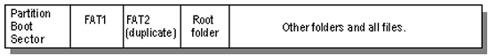

# 🔧 FAT32 File Recovery Tool

> **Công cụ khôi phục tập tin đã bị xóa trên hệ thống tập tin FAT32**
> 
> Chương trình được viết bằng C++ trên nền tảng Windows, sử dụng Windows API để truy cập trực tiếp vào ổ đĩa ở mức thấp (raw disk access), phân tích cấu trúc FAT32 và khôi phục các tập tin đã bị xóa.

---

## 📑 Mục lục

- [Tổng quan](#-tổng-quan)
- [Kiến thức nền tảng về FAT32](#-kiến-thức-nền-tảng-về-fat32)
  - [Cấu trúc tổng quan của FAT32](#1-cấu-trúc-tổng-quan-của-fat32)
  - [Boot Sector (BPB)](#2-boot-sector-bpb---bios-parameter-block)
  - [Bảng FAT (File Allocation Table)](#3-bảng-fat-file-allocation-table)
  - [Directory Entry](#4-directory-entry)
  - [Long File Name (LFN)](#5-long-file-name-lfn)
  - [Cơ chế xóa tập tin trong FAT32](#6-cơ-chế-xóa-tập-tin-trong-fat32)
- [Kiến trúc chương trình](#-kiến-trúc-chương-trình)
- [Thuật toán khôi phục](#-thuật-toán-khôi-phục)
  - [Bước 1: Đọc Boot Sector](#bước-1-đọc-boot-sector)
  - [Bước 2: Tìm kiếm tập tin bị xóa](#bước-2-tìm-kiếm-tập-tin-bị-xóa)
  - [Bước 3: Khôi phục tập tin](#bước-3-khôi-phục-tập-tin)
- [Cấu trúc mã nguồn](#-cấu-trúc-mã-nguồn)
- [Hướng dẫn sử dụng](#-hướng-dẫn-sử-dụng)
- [Hạn chế](#-hạn-chế)

---

## 📋 Tổng quan

Khi một tập tin bị xóa trên hệ thống FAT32, hệ điều hành **không thực sự xóa dữ liệu** trên ổ đĩa. Thay vào đó, nó chỉ:

1. Đánh dấu byte đầu tiên của tên tập tin trong Directory Entry thành `0xE5`.
2. Đánh dấu các cluster tương ứng trong bảng FAT thành `0x00000000` (trống).

→ **Dữ liệu vẫn còn trên ổ đĩa** cho đến khi bị ghi đè bởi dữ liệu mới. Chương trình này khai thác đặc điểm này để khôi phục tập tin.

---

## 📚 Kiến thức nền tảng về FAT32

### 1. Cấu trúc tổng quan của FAT32

Một phân vùng FAT32 được chia thành các vùng sau:



Trong đó:
- **Boot Sector (Reserved Area)**: Chứa thông tin về cấu trúc ổ đĩa (BPB).
- **FAT Table**: Bảng ánh xạ cluster — cho biết cluster nào là tiếp theo trong chuỗi tập tin.
- **Data Region**: Nơi lưu trữ thực tế dữ liệu tập tin và thư mục gốc (Root Directory).

> **Công thức xác định vị trí vùng Data Region:**
> ```
> DataRegionStart = ReservedSectors + (NumberOfFATs × FATSize)
> ```

### 2. Boot Sector (BPB — BIOS Parameter Block)

Boot Sector nằm ở **Sector 0** của phân vùng, chứa các thông số quan trọng:

```c
typedef struct _BIOS_PARAM_BLOCK {
    BYTE  jump_instruction[3];    // Lệnh nhảy (JMP)
    BYTE  oem[8];                 // Nhãn OEM
    WORD  bytes_Sector;           // Số byte/sector (thường 512)
    BYTE  sec_Cluster;            // Số sector/cluster
    WORD  size_Sector_Reserved;   // Số sector dành riêng (Reserved)
    BYTE  fatCount;               // Số lượng bảng FAT (thường 2)
    WORD  Max_Root_Entry;         // Số entry tối đa Root Dir (FAT32 = 0)
    WORD  Total_Sector_FS;        // Tổng sector (FAT12/16, FAT32 = 0)
    ...
    DWORD FATSz32;                // Kích thước mỗi bảng FAT (sector)
    DWORD RootClus;               // Cluster bắt đầu của Root Directory
} BPB;
```

**Các thông số quan trọng nhất:**

| Offset | Kích thước | Trường | Mô tả |
|--------|-----------|--------|-------|
| `0x0B` | 2 bytes | `bytes_Sector` | Số byte mỗi sector (512) |
| `0x0D` | 1 byte | `sec_Cluster` | Số sector mỗi cluster |
| `0x0E` | 2 bytes | `size_Sector_Reserved` | Số sector Reserved Area |
| `0x10` | 1 byte | `fatCount` | Số bảng FAT |
| `0x24` | 4 bytes | `FATSz32` | Kích thước bảng FAT (sector) |
| `0x2C` | 4 bytes | `RootClus` | Cluster đầu của Root Dir |

### 3. Bảng FAT (File Allocation Table)

Bảng FAT là **mảng các entry 4 byte**, mỗi entry tương ứng với một cluster trong Data Region.

```
Index:   [0]   [1]   [2]        [3]        [4]        [5]     ...
Value:  Media  EOC   0x00000003 0x00000004 0x0FFFFFFF 0x00000000
         │      │       │          │          │          │
         │      │       └── File A: Cluster 2 → 3 → 4 → EOF
         │      │                                       │
         │      │                                       └── Cluster 5: Trống
         │      └── End of Chain marker
         └── Media type descriptor
```

**Các giá trị đặc biệt:**

| Giá trị | Ý nghĩa |
|---------|---------|
| `0x00000000` | Cluster trống (chưa sử dụng) |
| `0x0FFFFFF8` – `0x0FFFFFFF` | End of Chain (EOF) — kết thúc chuỗi cluster |
| `0x0FFFFFF7` | Bad cluster |
| Giá trị khác | Số cluster tiếp theo trong chuỗi |

> **Công thức tính offset của entry trong bảng FAT:**
> ```
> FATEntryOffset = FATStartOffset + (ClusterNumber × 4)
> FATStartOffset = ReservedSectors × BytesPerSector
> ```

### 4. Directory Entry

Mỗi tập tin/thư mục được mô tả bởi một **Directory Entry 32 byte** trong Root Directory (hoặc Sub-directory):

```c
typedef struct dir {
    BYTE  fName[8];           // Tên tập tin (8.3 format)
    BYTE  ext[3];             // Phần mở rộng
    BYTE  state;              // Thuộc tính (Attribute)
    BYTE  rest[6];            // Dự trữ
    WORD  date;               // Ngày truy cập cuối  
    WORD  start_clus_high;    // 16 bit cao của cluster bắt đầu
    BYTE  rest2[4];           // Dự trữ
    WORD  start_clus_low;     // 16 bit thấp của cluster bắt đầu
    DWORD fSize;              // Kích thước tập tin (bytes)
} DIR;
```

**Byte thuộc tính (Attribute):**

| Bit | Giá trị | Ý nghĩa |
|-----|---------|---------|
| 0 | `0x01` | Read Only |
| 1 | `0x02` | Hidden |
| 2 | `0x04` | System |
| 3 | `0x08` | Volume Label |
| 4 | `0x10` | Directory (Thư mục) |
| 5 | `0x20` | Archive |
| — | `0x0F` | Long File Name Entry |

> **Cluster bắt đầu (32-bit):**
> ```
> StartCluster = (start_clus_high << 16) | start_clus_low
> ```

### 5. Long File Name (LFN)

FAT32 hỗ trợ tên tập tin dài (hơn 8.3 format) thông qua **LFN Entries** — các entry phụ 32 byte nằm **trước** entry chính (SFN).

```
┌─────────────────────────────────┐
│ LFN Entry 3  (0x43 | seq)      │  ← Entry phụ cuối cùng (đánh dấu 0x40)
│ attr = 0x0F                     │
├─────────────────────────────────┤
│ LFN Entry 2  (0x02)            │  ← Entry phụ thứ 2
│ attr = 0x0F                     │
├─────────────────────────────────┤
│ LFN Entry 1  (0x01)            │  ← Entry phụ thứ 1
│ attr = 0x0F                     │
├─────────────────────────────────┤
│ SFN Entry (Short File Name)    │  ← Entry chính (8.3)
│ attr = 0x20 (Archive)          │
└─────────────────────────────────┘
```

**Cấu trúc LFN Entry (32 bytes):**

| Offset | Kích thước | Nội dung |
|--------|-----------|----------|
| 0 | 1 byte | Sequence number (`0x01`, `0x02`... entry cuối `OR` `0x40`) |
| 1–10 | 10 bytes | 5 ký tự UTF-16 (phần 1) |
| 11 | 1 byte | Attribute = `0x0F` |
| 12 | 1 byte | Type (luôn = 0) |
| 13 | 1 byte | Checksum (tính từ SFN) |
| 14–25 | 12 bytes | 6 ký tự UTF-16 (phần 2) |
| 26–27 | 2 bytes | First cluster (luôn = 0) |
| 28–31 | 4 bytes | 2 ký tự UTF-16 (phần 3) |

> **Thuật toán tính Checksum:**
> ```c
> BYTE checksum = 0;
> for (int i = 0; i < 11; i++) {
>     checksum = ((checksum >> 1) | (checksum << 7)) + SFN_Name[i];
> }
> ```

### 6. Cơ chế xóa tập tin trong FAT32

Khi người dùng xóa tập tin, hệ điều hành thực hiện **2 thao tác**:

```
              TRƯỚC KHI XÓA                          SAU KHI XÓA
              
Directory Entry:                          Directory Entry:
┌──────────────────────────┐              ┌──────────────────────────┐
│ fName[0] = 'R'           │    ───►      │ fName[0] = 0xE5          │
│ "REPORT  TXT"            │              │ "?EPORT  TXT"            │
│ Cluster = 100            │              │ Cluster = 100 (giữ nguyên)│
│ Size = 2048              │              │ Size = 2048   (giữ nguyên)│
└──────────────────────────┘              └──────────────────────────┘

Bảng FAT:                                Bảng FAT:
┌───────┬───────┬───────┬───────┐        ┌───────┬───────┬───────┬───────┐
│ [100] │ [101] │ [102] │ [103] │        │ [100] │ [101] │ [102] │ [103] │
│  101  │  102  │  103  │  EOF  │  ───►  │  0x00 │  0x00 │  0x00 │  0x00 │
└───────┴───────┴───────┴───────┘        └───────┴───────┴───────┴───────┘

Vùng dữ liệu:                           Vùng dữ liệu:
┌─────────────────────────────┐          ┌─────────────────────────────┐
│ DỮ LIỆU VẪN CÒN NGUYÊN    │   ───►   │ DỮ LIỆU VẪN CÒN NGUYÊN    │
│ (Không bị xóa!)            │          │ (Chưa bị ghi đè!)          │
└─────────────────────────────┘          └─────────────────────────────┘
```

**Điểm mấu chốt:**
- Byte đầu tiên của tên file → `0xE5` (đánh dấu đã xóa)
- Các entry LFN phụ → byte đầu cũng bị đặt thành `0xE5`
- Bảng FAT → các cluster tương ứng bị reset thành `0x00`
- **Dữ liệu thực tế không bị xóa** → có thể khôi phục

---

## 🏗 Kiến trúc chương trình

Chương trình sử dụng **Strategy Design Pattern** để hỗ trợ đa hệ thống tập tin (FAT32, NTFS):

```
                    ┌─────────────────────┐
                    │      Recover        │
                    │─────────────────────│
                    │ - rs: RecoverStrategy│
                    │ + StartRecover()    │
                    └─────────┬───────────┘
                              │ uses
                              ▼
                    ┌─────────────────────┐
                    │  RecoverStrategy    │  ◄── Interface (Abstract)
                    │  (Abstract Class)   │
                    │─────────────────────│
                    │ + ReadMFTOrFATFrom  │
                    │   Disk()            │
                    │ + FindAndRecover()  │
                    │ + SetdriveLetter()  │
                    │ + GetdriveLetter()  │
                    └──────┬──────┬───────┘
                           │      │
                ┌──────────┘      └──────────┐
                ▼                            ▼
      ┌─────────────────┐         ┌─────────────────┐
      │      NTFS       │         │      FAT32      │
      │─────────────────│         │─────────────────│
      │ + ReadMFTOrFAT  │         │ + ReadMFTOrFAT  │
      │   FromDisk()    │         │   FromDisk()    │
      │ + FindAndRecover│         │ + FindAndRecover│
      │   ()            │         │   ()            │
      └─────────────────┘         │ + recoverFile() │
                                  │ + searchFor     │
                                  │   DeletedFiles()│
                                  │ + markClusterEOF│
                                  │   ()            │
                                  │ + ...           │
                                  └─────────────────┘
```

**Luồng hoạt động chính:**

```
main() → Nhập ổ đĩa → Phát hiện File System → Tạo Strategy (FAT32/NTFS) → StartRecover()
                                                        │
                                          ┌─────────────┴─────────────┐
                                          ▼                           ▼
                                  ReadMFTOrFATFromDisk()      FindAndRecover()
                                  (Mở ổ đĩa raw)             (Menu chính)
                                                                  │
                                                    ┌─────────────┼─────────────┐
                                                    ▼                           ▼
                                            Liệt kê files              Khôi phục file
                                            (Option 1)                 (Option 2)
```

---

## ⚙ Thuật toán khôi phục

### Bước 1: Đọc Boot Sector

```
1. Mở ổ đĩa ở chế độ raw access: CreateFileA("\\\\.\\X:")
2. Đọc 512 byte đầu tiên (Sector 0) → Boot Sector
3. Parse cấu trúc BPB để lấy các thông số:
   - bytes_Sector    : Kích thước sector
   - sec_Cluster     : Số sector/cluster  
   - size_Sector_Reserved : Số sector reserved
   - fatCount        : Số bảng FAT
   - FATSz32         : Kích thước bảng FAT
4. Tính vị trí Root Directory:
   rootDirStart = size_Sector_Reserved + (fatCount × FATSz32)
   rootDirOffset = rootDirStart × bytes_Sector
```

### Bước 2: Tìm kiếm tập tin bị xóa

```
1. Di chuyển con trỏ đọc đến rootDirOffset
2. Đọc từng sector (512 bytes), duyệt từng entry (32 bytes):
   
   FOR mỗi entry 32 bytes:
     IF entry.attribute == 0x0F AND entry.fName[0] == 0xE5:
       → Đây là LFN entry bị xóa → lưu vào danh sách LFN
       → Ghi nhận ký tự đầu tiên (firstLetter) từ dữ liệu LFN
       
     ELSE IF entry.fName[0] == 0xE5 AND hasValidAttribute(entry.state):
       → Đây là SFN entry bị xóa (entry chính)
       → Ghép tên từ LFN entries (nếu có) hoặc dùng SFN
       → Khôi phục ký tự đầu tiên của tên file
       → Lưu thông tin: tên file, cluster bắt đầu, offset entry
       
     ELSE IF entry.fName[0] == 0x00:
       → Kết thúc danh sách → RETURN
```

### Bước 3: Khôi phục tập tin

Chương trình hỗ trợ **2 chế độ** khôi phục:

#### Chế độ 1: Khôi phục tại chỗ (In-place Recovery)

Khôi phục trực tiếp trên ổ đĩa FAT32 bằng cách sửa Directory Entry và bảng FAT:

```
1. LOCK & DISMOUNT volume (đảm bảo quyền ghi)

2. KHÔI PHỤC DIRECTORY ENTRY:
   a. Đọc sector chứa entry bị xóa
   b. Khôi phục các LFN sub-entries:
      - Đặt lại sequence number (0x01, 0x02, ... 0x40|N)
      - Thay byte đầu 0xE5 → sequence number gốc
   c. Khôi phục SFN entry:
      - Tính checksum phù hợp với LFN
      - Tìm byte đầu tiên phù hợp (brute-force 0x00–0xFF)
   d. Ghi sector đã sửa trở lại ổ đĩa

3. KHÔI PHỤC BẢNG FAT:
   IF file chỉ có 1 cluster:
     → markClusterEOF(): Ghi 0x0FFFFFFF vào FAT entry
   ELSE (file nhiều cluster):
     → markMultipleEOF(): 
        - Tạo chuỗi liên tiếp: cluster[i] → cluster[i+1]
        - Cluster cuối → 0x0FFFFFFF (EOF)
```

#### Chế độ 2: Khôi phục ra thư mục chỉ định (Copy to NTFS)

Trích xuất dữ liệu thô từ ổ đĩa và ghi ra tập tin mới trên ổ đĩa khác:

```
1. Tính vị trí dữ liệu trên ổ đĩa:
   clusterOffset = (DataRegionStart + (cluster - 2) × sec_Cluster) × bytes_Sector

2. Tính số cluster cần đọc:
   totalClusters = ceil(fileSize / bytesPerCluster)

3. Đọc dữ liệu tuần tự:
   FOR i = 0 TO totalClusters - 1:
     → Đọc bytesPerCluster byte từ cluster (startCluster + i)
     → Ghi vào file output (giới hạn bởi fileSize còn lại)

4. File được lưu vào thư mục "FAT32_Recovered_Files/"
```

---

## 📁 Cấu trúc mã nguồn

```
RestoreFile_project/
├── main.cpp                 # Entry point — phát hiện file system, khởi tạo Strategy
├── recover.h                # Header — định nghĩa struct BPB, DIR, class FAT32, NTFS
├── recover.cpp              # Implementation class NTFS + Recover (Strategy pattern)
├── recover_FAT32.cpp        # Implementation class FAT32 — toàn bộ logic khôi phục
├── wstring_string.h         # Header — chuyển đổi wstring ↔ string
├── wstring_string.cpp       # Implementation chuyển đổi encoding
└── README.md                # Tài liệu hướng dẫn (file này)
```

### Các hàm chính trong class FAT32

| Hàm | Chức năng |
|-----|-----------|
| `ReadMFTOrFATFromDisk()` | Mở ổ đĩa ở chế độ raw access |
| `FindAndRecover()` | Menu chính: liệt kê/khôi phục tập tin |
| `readBootSector()` | Đọc và parse Boot Sector (BPB) |
| `listAllFilesAndFolders()` | Liệt kê tất cả tập tin/thư mục trong Root Directory |
| `searchForDeletedFiles()` | Quét Root Directory tìm entry có `0xE5` |
| `recoverFile()` | Điều phối quá trình khôi phục (2 chế độ) |
| `extractLFN()` | Trích xuất tên từ LFN entry (UTF-16 → string) |
| `getShortFileName()` | Lấy tên từ SFN entry (8.3 format) |
| `setOriginalEntries()` | Khôi phục LFN sub-entries (sequence number) |
| `setCheckSum()` | Tính và sửa checksum SFN ↔ LFN |
| `markClusterEOF()` | Đánh dấu 1 cluster là EOF trong bảng FAT |
| `markMultipleEOF()` | Tạo chuỗi cluster liên tiếp + EOF cho file lớn |
| `recoverContiguousToNTFS()` | Đọc raw data và ghi ra file trên ổ đĩa khác |
| `hasValidAttribute()` | Kiểm tra thuộc tính entry hợp lệ |
| `getClusterCount()` | Tính số cluster dựa trên kích thước file |

---

## 🚀 Hướng dẫn sử dụng

### Yêu cầu hệ thống
- **OS**: Windows 10/11
- **Compiler**: MSVC hoặc MinGW (hỗ trợ C++17)
- **Quyền**: **Chạy với quyền Administrator** (bắt buộc để truy cập raw disk)

### Biên dịch

```powershell
# Sử dụng g++ (MinGW)
g++ -std=c++17 -o restore.exe main.cpp recover.cpp recover_FAT32.cpp wstring_string.cpp -lole32

# Hoặc sử dụng MSVC
cl /EHsc /std:c++17 main.cpp recover.cpp recover_FAT32.cpp wstring_string.cpp
```

### Chạy chương trình

```powershell
# Chạy với quyền Administrator
.\restore.exe
```

### Luồng sử dụng

```
1. Nhập ký tự ổ đĩa (ví dụ: E, F, G...)
   → Chương trình tự động phát hiện FAT32

2. Chọn chức năng:
   [1] Liệt kê các files có trong ổ đĩa
   [2] Khôi phục file

3. Nếu chọn [2]:
   → Hiển thị danh sách file đã xóa
   → Chọn file cần khôi phục (nhập số thứ tự)
   
4. Chọn nơi khôi phục:
   [1] Khôi phục vào thư mục gốc (sửa trực tiếp trên ổ FAT32)
   [2] Khôi phục vào thư mục chỉ định (FAT32_Recovered_Files/)
```

---

## ⚠ Hạn chế

| Hạn chế | Mô tả |
|---------|-------|
| **Chỉ quét Root Directory** | Chưa hỗ trợ quét đệ quy các thư mục con |
| **Giả định cluster liên tiếp** | Thuật toán khôi phục giả định file nằm trên các cluster liên tiếp (contiguous). File bị phân mảnh (fragmented) có thể khôi phục không chính xác |
| **Chưa hỗ trợ exFAT** | Chỉ hỗ trợ FAT32 và NTFS |
| **Yêu cầu Administrator** | Cần quyền admin để truy cập raw disk |
| **SFN recovery hạn chế** | Với file không có LFN, ký tự đầu tiên bị mất → thay bằng `_` |

---

## 📄 License

Dự án phục vụ mục đích học tập và nghiên cứu.
